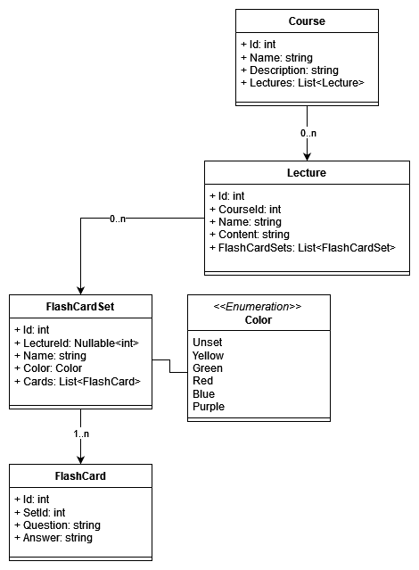

# StudyZen

## Description

## Architecture
All of the following diagrams can be modified using [draw.io](https://app.diagrams.net/) for files in [docs](./docs/). 

## Planned features
- Creating and adding new courses, lectures
- Uploading lecture material from a file
- Creating flashcards for each lecture (private for each user)
- Lecture quiz
- Some type of points system
	- Leaderboard
	- Rewards (?)
- Review and Reflection, what to improve tracking , notes.	
- Relax mode, with videos or nature sounds (?)

## Authors
- Vesta Cicenaite
- Evelina Temnolonskyte
- Akvile Ruginyte
- Arminas Brazenas

## Support